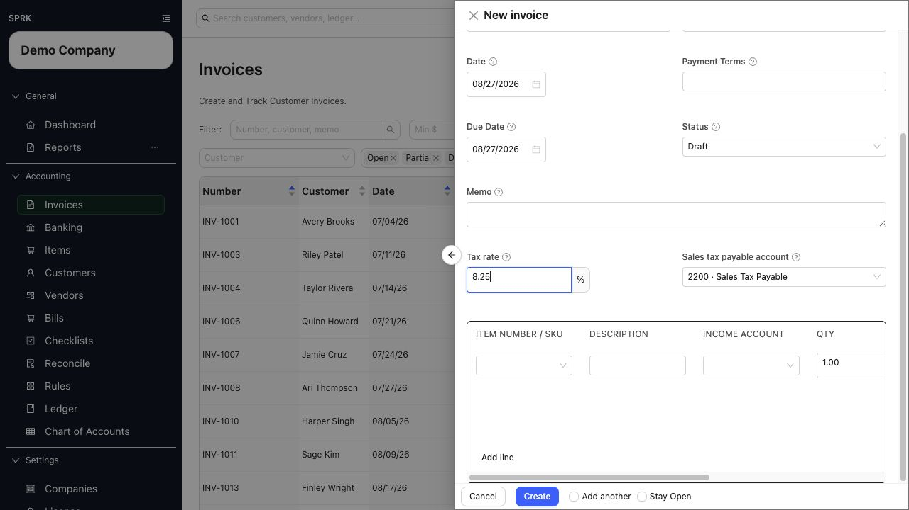

# Create Invoices

Create a customer invoice, choose the receivables or paid-now route, and review the posting-sensitive fields before saving.

## When To Use This

- You need to enter a new customer invoice.
- You need the invoice to stay in `Draft`, move to `Open`, or settle immediately.
- You need to review customer terms, due date, item details, and income accounts before saving.

## Before You Start

- A customer record exists, or you are ready to add one from the invoice drawer.
- The invoice amount can be built from one or more lines.
- Your company is ready to use invoices in receivables workflows.
- You know whether `Receive to` should use an Accounts Receivable control account or a cash, bank, or credit-card settlement account.
- If the customer uses saved payment terms, review the filled due date before saving.

## Steps

1. Open `Invoices`.
2. Select `New`.
3. Complete the invoice header:
   - `Invoice #`
   - `Customer`
   - `Receive to`
   - `Default income account`
   - `Date`
   - `Payment Terms`, if needed
   - `Due Date`
   - `Status`
   - `Memo`
   - `Tax rate`, if needed
4. If company `Sales / Invoicing` defaults are configured, review the starting payment terms, due date, and workflow status before you continue.
   - `Default invoice payment terms` can seed a new invoice when no customer or invoice value is already supplied.
   - `New invoice workflow` can start new invoices as `Draft` or `Open`, depending on company setup.
5. If the selected customer already has saved payment terms, review the `Payment Terms` value SPRK fills in for you.
6. Review the resulting `Due Date` before saving.
   - Common terms such as `Due on receipt`, `Due upon receipt`, `EOM`, `x/y net N`, and `Net N` can calculate due dates.
   - Treat unusual freeform terms as values to review manually.
   - If you need an exception for this invoice, replace the default due date before you save.
7. Choose `Receive to` carefully:
   - Use an Accounts Receivable control account when the invoice should stay on the open accrual path.
   - Use a cash, bank, or credit-card settlement account only when the invoice is being recorded as paid immediately.
   - Receivable control routing and settlement-account routing are alternative paths, not two fields to combine on the same invoice.
8. Add one or more invoice lines.
9. Use `Item Number / SKU` or `Description` to pull matching item details into the line when available.
   - In companies set to `Description only`, supported item-entry helpers may show descriptions without item numbers.
10. Review quantity, unit price, line `Income account`, and extended amount on each line.
    - `Default income account` fills blank line income accounts when the drawer supports that fallback.
    - The line-level `Income account` is the posting source for that line.
11. If the customer or item does not exist yet, create it inline from the invoice drawer and continue without leaving the page.
12. Decide how the invoice should be saved:
    - `Draft` keeps the invoice unposted.
    - `Open` moves the invoice into an active receivables state when `Receive to` is an Accounts Receivable control account.
    - Choosing a settlement account in `Receive to` can route the invoice through the paid-now path instead of leaving an open receivable.
13. If you choose `Open`, confirm `Receive to`, due date, and lines one more time before saving.
14. Save the invoice.
15. Review the invoice list to confirm the expected status, total, balance, terms, and due date.

## What Happens When You Save

The invoice appears in the invoice list with the expected number, customer, totals, balance, payment timing, and status.

- `Draft` stores the invoice without posting.
- `Open` with an Accounts Receivable control account moves the invoice into the receivables workflow.
- A settlement account in `Receive to` routes the invoice through the paid-now path instead of leaving an open receivable.
- Line-level `Income account` values control the revenue side of the posting when the invoice posts.

## If Something Looks Wrong

| What You See | What To Check | What To Do Next |
|---|---|---|
| The invoice stayed in `Draft` | Whether `Status` was set to `Draft` before saving | Edit the invoice and choose the intended workflow status before saving again |
| The invoice did not stay open as a receivable | Whether `Receive to` used a settlement account instead of an Accounts Receivable control account | Use the receivables route when the customer still owes the balance |
| The due date looks wrong | Customer terms, invoice date, and any manual due date | Correct the date before sending or relying on the invoice |
| Revenue looks routed to the wrong account | The line-level `Income account` values | Correct line accounts before saving or use a posted correction path if already posted |
| Item numbers are missing from entry helpers | The company `Item identification` setting | Use description-based selection when the company is set to `Description only` |

## Related

- [Create and open invoices](./create-and-open-invoices.md)
- [Review and edit invoices](./review-and-edit-invoices.md)
- [Receive invoice payments](./receive-invoice-payments.md)
- [Set up receivables defaults before invoicing](./set-up-receivables-defaults-before-invoicing.md)
- [Manage customers](./manage-customers.md)
- [Manage items for invoicing](./manage-items-for-invoicing.md)
