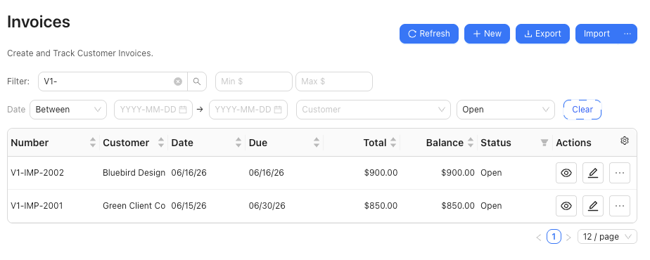

# Import Invoices

Import grouped invoice rows from a spreadsheet or CSV after reviewing customer, line, and account-routing details.

## When To Use This

- You already have invoice rows in a spreadsheet or CSV.
- You want SPRK to create grouped invoice documents after preview.
- You need to review whether imported invoices should stay open or be treated as paid-now.

## Before You Start

- Confirm the active company.
- Confirm customers, items, and income accounts are ready for the file.
- Review whether `Receive to` should route each invoice to Accounts Receivable or a settlement account.
- Keep the original file available until import results have been reviewed.

## Steps

1. Open the invoice import path from `Invoices`.
2. Choose the invoice file.
3. Review the preview before confirming.
4. Check grouped document fields such as:
   - `Customer Name`
   - `Due Date`
   - `SKU` or `Item`
   - `Memo`
   - `Tax Rate`
   - `Status`
   - `Amount`
   - `Line Amount`
   - `Extended Amount`
5. Review account-routing headers when the file includes them:
   - `Receive to`
   - `Default Income Account`
   - `Line Income Account`
6. Confirm that each invoice has a customer, at least one line, valid line account or item details, positive quantities, and a non-duplicate invoice number.
7. Confirm the import only after warnings and routing choices have been reviewed.

## What Happens When You Import

SPRK creates invoice documents from grouped rows after preview. `Receive to` follows the same routing rule as the invoice drawer: an Accounts Receivable control account keeps the imported invoice on the accrual path, while a non-control cash, bank, or credit-card settlement account imports as paid-now. `Default Income Account` fills blank line income accounts; `Line Income Account` remains the posting source of truth.

Imports that try to mix receivable control routing and settlement-account routing for the same invoice are rejected instead of silently guessing the posting path.

## If Something Looks Wrong

| What You See | What To Check | What To Do Next |
|---|---|---|
| The preview does not group lines as expected | Invoice number, customer, and line fields | Fix the file before confirming |
| The file leaves a customer unresolved | Customer name or customer identifier in the file | Add or correct the customer before import |
| An invoice routes as paid-now | The `Receive to` account | Use an Accounts Receivable control account when the invoice should remain open |
| A line posts to the wrong income account | `Line Income Account` and fallback `Default Income Account` | Correct the account values before confirming |
| The import reports duplicate invoice numbers | Existing invoice numbers and file invoice numbers | Resolve duplicate numbers before confirming |

## Practice And Examples

- Practice file: [invoice-import-grouped-lines.csv](../sample-files/practice/invoice-import-grouped-lines.csv)

The grouped-line import example shows open invoices created from [invoice-import-grouped-lines.csv](../sample-files/practice/invoice-import-grouped-lines.csv).

## Related

- [Create invoices](./create-invoices.md)
- [Before you import](../company-setup-and-migration/before-you-import.md)
- [Manage customers](./manage-customers.md)
- [Manage items for invoicing](./manage-items-for-invoicing.md)
- [Understand invoice general ledger impact](./understand-invoice-general-ledger-impact.md)
