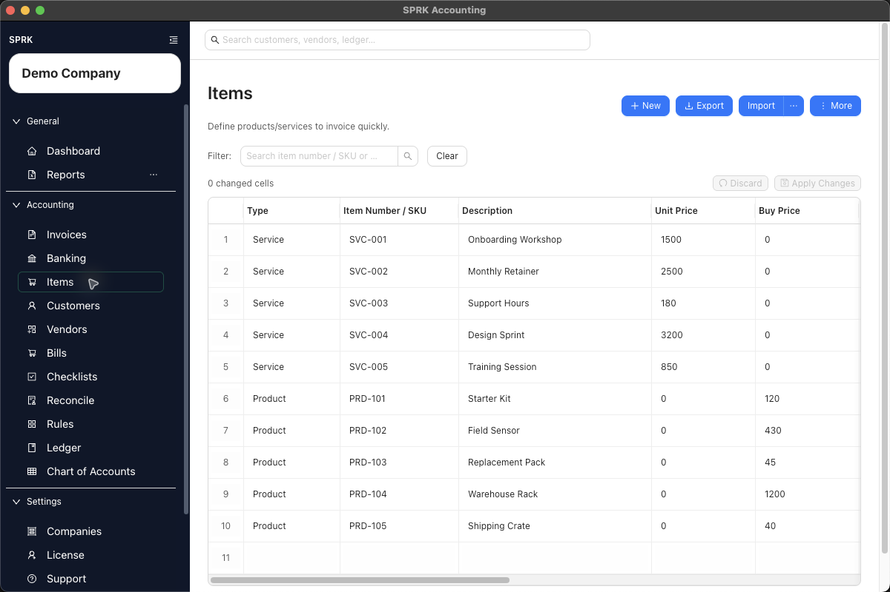

# Manage Items for Invoicing

Define reusable products and services so invoice and bill lines can be built faster and with more consistent descriptions, pricing, and account defaults.

## When To Use This

Use this workflow when you want invoice lines to reuse prepared item records instead of retyping descriptions, prices, and sales defaults each time.

## Before You Start

- You can open the `Items` page.
- You know whether the record should be set up as a service, product, or other item type.
- You know whether the company should show items as `Item number + description` or `Description only`.

## Steps

1. Open `Items`.
2. Choose the setup path that fits the job:
   - Use `New` to create one item from the drawer.
   - Use `Import` if you already maintain item data in a spreadsheet or CSV file.
   - Use `More` > `Enable Grid Mode` when you need to edit several items together, or turn on `Grid Edit default` in `Preferences` if you want supported pages to open that way automatically.
3. Enter the core item details:
   - `Item type`
   - `Item Number / SKU`
   - `Description`
   - `Unit price`
   - `Unit of measure`
4. Fill in the extra pricing and tax fields when they matter for your workflow:
   - `Buy price`
   - `Sell price`
   - `Tax code`
5. If your accounting setup uses account defaults, review:
   - `Income account`
   - `Expense/COGS account`
6. Confirm the `Active` setting, then save the item.
7. If you import items, review any mapped income or expense accounts before you rely on those records in invoices.
8. Use the page search when you need to find an item later by item number, SKU, or description.
9. Use the saved item later from invoice line selectors so invoice entry stays more consistent.
10. Use item row actions when you want to start a document directly from an item:
   - `Create Invoice` opens an invoice drawer with the selected item ready for invoice-line review.
   - `Create Bill` opens a bill drawer with the selected item ready for bill-line review where that workflow is available.
   - Review the customer or vendor, account, price or cost, quantity, tax, and status before saving. The shortcut starts the document; it does not post it by itself.
11. Use Grid Edit when repeated item cleanup will be faster than opening each record individually, then review the changed-cell count before selecting `Apply Changes`.

## Item Identification Mode

Company setup can control how supported item labels appear:

- `Item number + description` shows item numbers beside descriptions where the current workflow supports it.
- `Description only` hides item numbers from supported item selectors, invoice drawers, and line-entry helpers.

This is a presentation setting. It does not delete the item number from the item record, change the item's income or expense accounts, or change posting behavior.

## What Happens Next

The item becomes available for invoice entry, item-started invoices or bills where available, and future lines can reuse its saved description, pricing, unit-of-measure, and account defaults.

## If Something Looks Wrong

- Skipping item setup and retyping invoice lines manually even when the same products or services repeat.
- Leaving descriptions too vague, which makes invoices and reporting harder to read later.
- Forgetting to review the active setting and then wondering why an older item should no longer be used.
- Importing item records without checking that account mappings resolved the way you expected.
- Assuming item setup alone controls the full receivables posting flow. Review the invoice workflow and GL guidance for downstream behavior.
- Assuming hidden item numbers mean the item number was deleted. Check the company `Item identification` mode.
- Saving a document started from an item shortcut without reviewing the document header and line accounts.

## Related

- [Set up receivables defaults before invoicing](./set-up-receivables-defaults-before-invoicing.md)
- [Manage customers](./manage-customers.md)
- [Create and open invoices](./create-and-open-invoices.md)
- [Understand invoice general ledger impact](./understand-invoice-general-ledger-impact.md)
- [Use grid edit for bulk record maintenance](../dashboard-and-navigation/use-grid-edit-for-bulk-record-maintenance.md)
