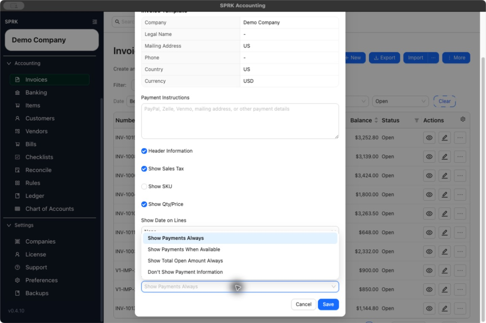
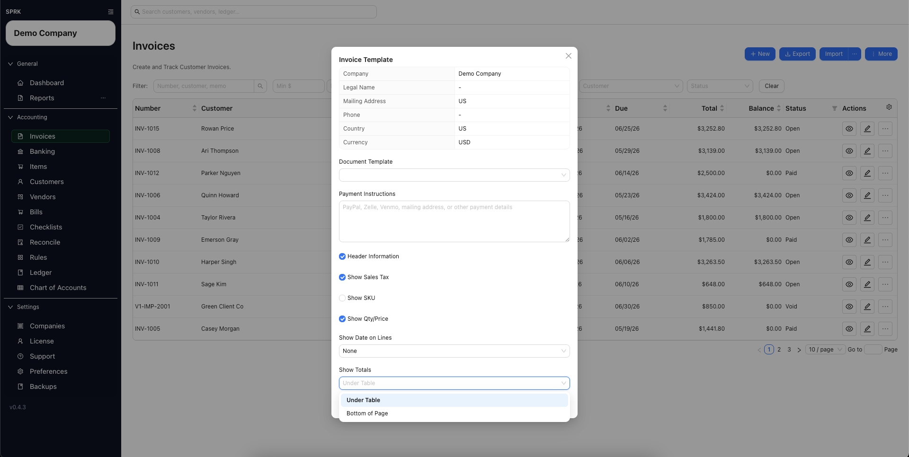

# Print Invoices

<!-- Last validated: 2026-07-15 (SPRK 0.4.10, Demo Company) -->
<!-- Screenshot status: Current; Payment Information choices captured 2026-07-15 -->

Print customer-facing invoice copies and review invoice template settings before sending output to a customer.

## When to use this

- You need to print or save customer-facing invoice output.
- You need to review the company-wide invoice print layout.
- You need to confirm whether SKU, sales tax, quantities, prices, dates, or totals should appear.

## Before you start

- Confirm the active company.
- Confirm the invoice number, customer, date, total, and balance.
- Review the invoice before printing if the customer-facing copy will be sent outside your firm.

## Steps

1. Open `Invoices`.
2. Use the row action `Print` when you want to print directly from the invoice list without opening edit mode first.
   - You can also open an invoice for editing and use the drawer header `Actions` > `Print`.
3. Use `More` > `Invoice Template` when you need to change the company-wide print layout.
4. Review the visible print settings before saving:
   - `Header Information`
   - `Show Sales Tax`
   - `Show SKU`
   - `Show Qty/Price`
   - `Show Date on Lines`
   - `Show Totals`
   - `Payment Information`
5. Leave settings on when you want the full customer-facing layout.
6. Use the switches and choices for specific presentation needs:
   - `Header Information` controls the company header block. Invoice metadata and `Bill To` details remain part of the invoice layout.
   - `Show Sales Tax` controls the sales-tax total line.
   - `Show SKU` controls the SKU column.
   - `Show Qty/Price` controls quantity and unit-price columns together.
   - `Show Date on Lines` can use `None`, `Due Date`, or `Invoice Date` as one shared date column for invoice lines.
   - `Show Totals` can place totals `Under Table` or at the `Bottom of Page`.
   - `Payment Information` controls printed payment detail:
     - `Show Payments Always` includes the payments section.
     - `Show Payments When Available` includes it only when active payments exist.
     - `Show Total Open Amount Always` shows the total open amount without a payment-history table.
     - `Don't Show Payment Information` omits payment details.
7. Review the printed preview before sending it to a customer.

## What This Changes

Printing and template review change the standard customer invoice output. They do not record a payment, change invoice balance, or edit ledger posting by themselves. The current settings modal does not expose a document-template selector; the visible controls adjust the standard customer invoice layout.

## If something looks wrong

| What You See | What To Check | What To Do Next |
|---|---|---|
| A printed invoice is missing SKU or line details | `Show SKU`, `Show Qty/Price`, and `Show Date on Lines` | Update the template setting before printing again |
| Totals appear in the wrong place | `Show Totals` | Choose `Under Table` or `Bottom of Page` |
| The company header does not look right | `Header Information` and company contact details | Review company and invoice template settings before sending the invoice |
| The printout does not show payment history | `Payment Information` and whether the invoice has active payments | Choose an appropriate payment mode, or use payment history inside SPRK for internal review |

## Related

- [Create and open invoices](./create-and-open-invoices.md)
- [Review and edit invoices](./review-and-edit-invoices.md)
- [Manage default company settings](../company-administration/manage-default-company-settings.md)
