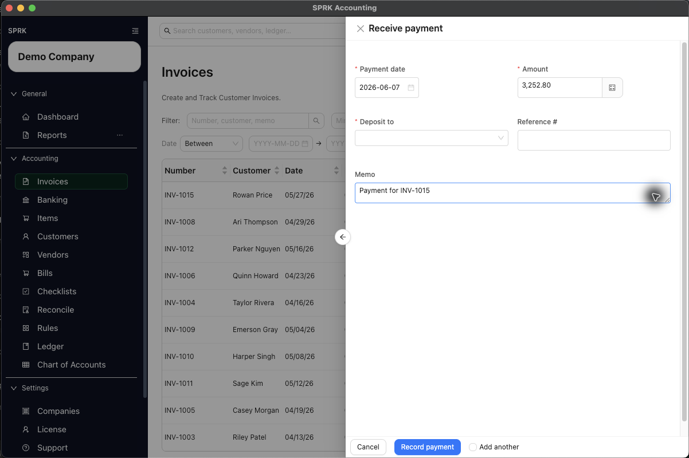

# Receive Invoice Payments

Record customer payments from the invoice list so SPRK updates the balance and posts the cash or bank side of the transaction, then review payment history and linked journals when you need the audit trail.

## Purpose

Use this workflow when a customer has paid an invoice and you want SPRK to reduce the receivable and update the invoice status correctly.

## Prerequisites

- The invoice already exists.
- The invoice is not already fully paid.
- A deposit account is available in the `Deposit to` selector.
- Your company has a default Accounts Receivable account configured for receivables workflows.
- The invoice is in an active receivables state such as `Open` or `Partial`.

## Steps

1. Open `Invoices`.
2. Find the invoice you want to collect against.
3. Select the dollar action for that invoice.
4. In `Receive payment`, complete:
   - `Payment date`
   - `Amount`
   - `Deposit to`
   - `Reference #`, if needed
   - `Memo`
5. Select `Record payment`.
6. If the payment is less than or different from the remaining balance, review the confirmation prompt before you continue.
7. Return to the invoice list and confirm the updated `Balance` and `Status`.
8. If you need collection follow-up for other invoices from the same customer, return to that customer record or aging report after the payment is recorded.
9. To review later, use the invoice row action menu for `View payment history` or `View linked journal entries`.

## Banking Match Path

When the customer payment first appears as a pending money-in row in `Banking`, use `Match bank transaction` when available. SPRK can suggest open invoices, show the candidate number, customer, dates, open amount, bank amount, and difference, then use `Receive Payment & Confirm` or `Receive Partial & Confirm` when the bank amount is eligible. Overpayments are not actionable from that Banking match path.

## Expected Result

SPRK records the payment, reduces the invoice balance, and updates the status:

- fully paid invoices become `Paid`
- partially paid invoices become `Partial`

Customer payment terms and credit settings can help you review receivables before collection, but they do not replace this payment workflow.

Current general ledger impact as of 2026-06-17:

- Recording a payment reduces Accounts Receivable and increases the selected deposit account according to the invoice payment workflow.
- Viewing payment history or linked journal entries does not post by itself.
- Reversing a payment-linked journal through a supported source-document confirmation can deactivate the payment application and reopen the invoice balance.

## Common Mistakes

- Editing the invoice status to `Paid` instead of using `Receive payment`.
- Assuming customer credit settings or invoice terms collect the payment automatically.
- Forgetting to choose `Deposit to`.
- Entering an amount greater than the remaining balance.
- Expecting a disabled dollar action on a paid invoice to reopen payment entry.
- Recording a payment manually and then matching the same bank transaction as another payment.
- Treating payment history as an edit screen.

## Related Articles

- [Configure customer payment terms and credit](./configure-customer-payment-terms-and-credit.md)
- [Create and open invoices](./create-and-open-invoices.md)
- [Understand invoice general ledger impact](./understand-invoice-general-ledger-impact.md)
- [Review document payment history and linked journals](../ledger-and-chart-of-accounts/review-document-payment-history-and-linked-journals.md)

## Info

- App sections: `invoices`
- Last validated: 2026-06-17
- Screenshot status: `captured`
