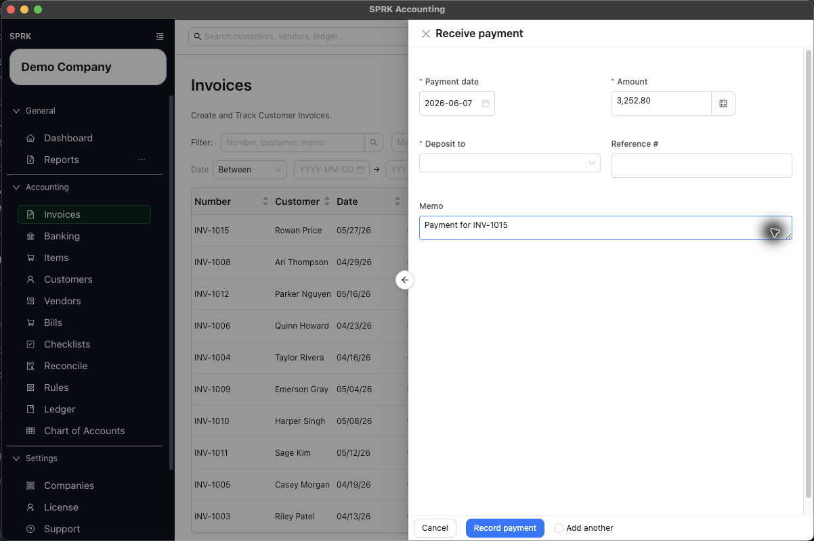
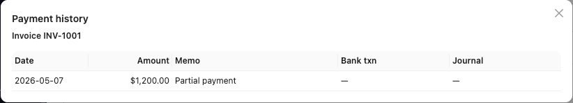
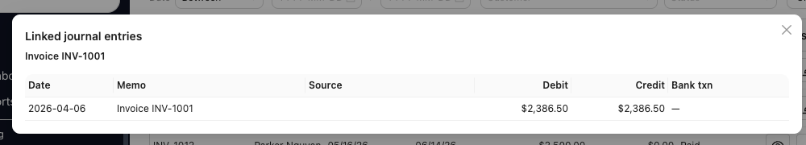

# Receive Invoice Payments

Record customer payments from the invoice list so SPRK updates the balance and posts the cash or bank side of the transaction, then review payment history and linked journals when you need the audit trail.

## When To Use This

Use this workflow when a customer has paid an invoice and you want SPRK to reduce the receivable and update the invoice status correctly.

## Before You Start

- The invoice already exists.
- The invoice is not already fully paid.
- A deposit account is available in the `Deposit to` selector.
- Your company has a default Accounts Receivable account configured for receivables workflows.
- The invoice is in an active receivables state such as `Open` or `Partial`.

## Steps

1. Open `Invoices`.
2. Find the invoice you want to collect against.
3. Select the dollar action for that invoice.
4. In `Receive payment`, complete:
   - `Payment date`
   - `Amount`
   - `Deposit to`
   - `Reference #`, if needed
   - `Memo`
5. If the settlement account is missing, use the inline account-create affordance from `Deposit to` when it is available.
   - Create only the bank, cash, or credit-card settlement account you actually want for this payment.
   - Inline account creation adds an account choice; it does not record the payment until you save the payment workflow.
6. Select `Record payment`.
7. If the payment is less than or different from the remaining balance, review the confirmation prompt before you continue.
8. Return to the invoice list and confirm the updated `Balance` and `Status`.
9. If you need collection follow-up for other invoices from the same customer, return to that customer record or aging report after the payment is recorded.
10. To review later, use the invoice row action menu for `View payment history` or `View linked journal entries`.

## Banking Match Path

When the customer payment first appears as a pending money-in row in `Banking`, use `Match bank transaction` when available. SPRK can suggest open invoices, show the candidate number, customer, dates, open amount, bank amount, and difference, then use `Receive Payment & Confirm` or `Receive Partial & Confirm` when the bank amount is eligible. Overpayments are not actionable from that Banking match path.

## What Happens Next

SPRK records the payment, reduces the invoice balance, and updates the status:

- fully paid invoices become `Paid`
- partially paid invoices become `Partial`

Customer payment terms and credit settings can help you review receivables before collection, but they do not replace this payment workflow.

- Recording a payment reduces Accounts Receivable and increases the selected deposit account according to the invoice payment workflow.
- Creating a `Deposit to` account inline only changes the available settlement-account choices. The payment itself is posted only when you record it.
- Viewing payment history or linked journal entries does not post by itself.
- Reversing a payment-linked journal through a supported source-document confirmation can deactivate the payment application and reopen the invoice balance.

## If Something Looks Wrong

| What You See | What To Check | What To Do Next |
|---|---|---|
| You are about to take an action that may affect the result | Editing the invoice status to `Paid` instead of using `Receive payment` | Confirm the visible company, page, and workflow state before continuing |
| The result looks ready, but a key check is unresolved | Assuming customer credit settings or invoice terms collect the payment automatically | Verify the visible SPRK state before continuing |
| A needed review step is missing | Forgetting to choose `Deposit to` | Go back to that check before continuing |
| You are about to take an action that may affect the result | Creating a missing `Deposit to` account inline and assuming that saved the payment too | Confirm the visible company, page, and workflow state before continuing |
| The entered value or selection does not produce the expected result | Entering an amount greater than the remaining balance | Correct the value or selection before continuing |
| The page does not show the expected result | Expecting a disabled dollar action on a paid invoice to reopen payment entry | Review the visible action or related workflow before continuing |
| You are about to take an action that may affect the result | Recording a payment manually and then matching the same bank transaction as another payment | Confirm the visible company, page, and workflow state before continuing |
| Two similar workflows or fields are easy to mix up | Treating payment history as an edit screen | Use the specific workflow or control named on this page |

## Practice And Examples

Use the practice file and screenshots to compare recording a payment, matching a bank deposit, and reviewing payment history after the invoice balance changes.

- Practice file: [bank-deposit-invoice-match.csv](../sample-files/practice/bank-deposit-invoice-match.csv)

Payment history and linked journals are review surfaces, not edit screens. The invoice action menu keeps payment review close to the source document.

## Related

- [Configure customer payment terms and credit](./configure-customer-payment-terms-and-credit.md)
- [Create and open invoices](./create-and-open-invoices.md)
- [Understand invoice general ledger impact](./understand-invoice-general-ledger-impact.md)
- [Review document payment history and linked journals](../ledger-and-chart-of-accounts/review-document-payment-history-and-linked-journals.md)
