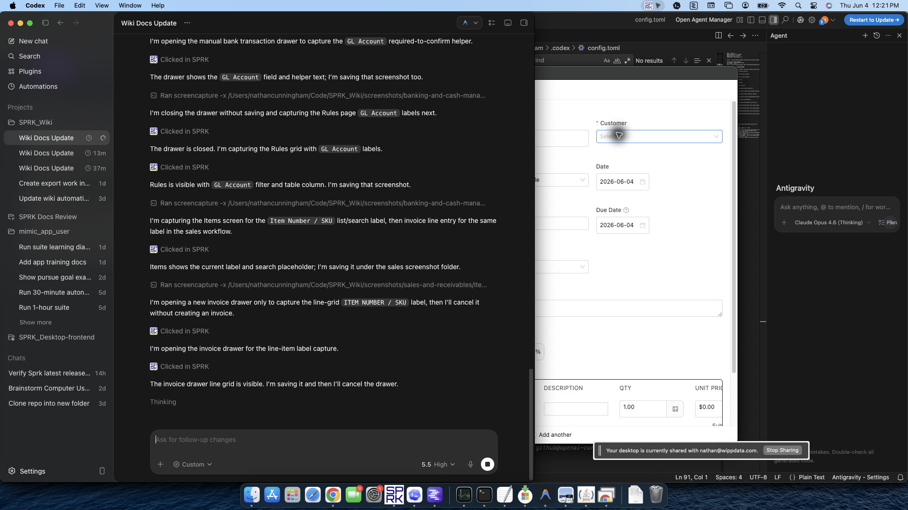

# Set Up Receivables Defaults Before Invoicing

Prepare customer, item, and account defaults before you start entering invoices so receivables activity is easier to review and maintain later.

## When To Use This

Use this page when you want invoice entry to start from cleaner defaults instead of rebuilding customer, item, and account choices on each invoice.

## Why This Matters

- Customer setup can carry a `Default Income Account` and standard payment terms.
- Item setup can carry reusable descriptions, pricing, unit-of-measure values, and income account choices.
- Company `Sales / Invoicing` setup can seed `Default invoice payment terms` and the `New invoice workflow` for new invoices.
- Company `Item identification` setup can decide whether supported item selectors show `Item number + description` or `Description only`.
- Invoice entry can reuse saved customers and items, or create them inline without leaving the invoice drawer.
- Cleaner setup reduces rework when you review open invoices, balances, and receivables aging later.

## Before You Start

- You can open `Customers`, `Items`, and `Invoices`.
- Your chart of accounts already includes the income accounts and receivables account you expect to use. Nonposting summary accounts and restricted control accounts may be visible in the chart but unavailable in posting-oriented invoice and default-account selectors.
- You know whether invoice lines should usually follow customer defaults, item defaults, or a one-off exception for the current job.

## Setup Workflow

1. Review your income and receivables accounts first.
2. Open company settings and review sales-related defaults if they are part of your rollout:
   - `Sales / Invoicing` stores `Default invoice payment terms` and `New invoice workflow`.
   - `Default invoice payment terms` can seed new invoices when no more specific value has already been supplied.
   - `New invoice workflow` can start new invoices as `Draft` or `Open`.
   - Due dates can be calculated for common terms such as `Due on receipt`, `Due upon receipt`, `EOM`, `x/y net N`, and `Net N`.
3. Review `Item identification` if item numbers should or should not appear during entry:
   - `Item number + description` keeps item numbers visible beside descriptions where supported.
   - `Description only` hides item numbers in supported item and invoice helpers without deleting the item numbers from item records.
4. Open `Customers` and decide whether the customer needs invoice-related defaults:
   - Set `Default Income Account` when this customer usually points to the same revenue category.
   - Set payment terms when most invoices for the customer follow the same due-date pattern.
5. Open `Items` and create or update the products or services you invoice repeatedly:
   - Save `Item Number / SKU` and `Description` values that users can recognize quickly during invoice entry.
   - Save `Unit price` and `Unit of measure` when those values repeat often.
   - Review `Income account` when you want the item record to carry its own sales default.
6. If you import customers or items, review the imported account mappings before you start invoicing.
7. Open `Invoices` and create a new invoice only after the main defaults are in place.
8. In the invoice drawer, review the header fields before adding lines:
   - `Customer`
   - `Receive to`
   - `Default income account`
   - `Date`
   - `Payment Terms`
   - `Due Date`
9. Use the line selectors to pull saved item details into invoice lines:
   - `Item Number / SKU` can fill matching description and price details.
   - `Description` can fill matching item number/SKU and price details.
   - In `Description only` mode, the supported selectors may show descriptions without item numbers.
10. Review line `Income account` values before saving. Header defaults and item defaults help fill lines, but the line account remains the posting source.
11. If the needed customer or item does not exist yet, create it inline from the invoice drawer and continue the invoice without leaving the workflow.
12. Before saving an invoice as `Open`, confirm `Receive to`, due date, and line details still match the intended transaction.

## What Happens Next

Invoice entry starts from cleaner defaults, repeated customers and items are easier to reuse, and open receivables are easier to review by customer, timing, and account structure.

## Downstream Effects

- Customer terms can fill invoice terms and help calculate a due date.
- Company terms and workflow defaults can seed new invoices, but each invoice still needs review before posting.
- The invoice still needs a reviewed `Receive to` value before it moves to an open receivable or paid-now settlement path.
- Saved item details can reduce manual entry and help keep invoice lines more consistent.
- Customer and item defaults improve setup quality, but they do not replace final invoice review.
- Customer default account selectors use eligible posting accounts and readable account labels where those columns are shown. If an active account is missing, check whether it is nonposting or control-restricted before assuming it was deleted.
- `Description only` item identification changes labels in supported workflows. It does not delete item numbers, change posting, or change import matching by itself.
- Receivables aging and invoice list review become easier when customer names, due dates, and line details are consistent.

## If Something Looks Wrong

- Starting invoice entry before the chart of accounts is ready for receivables and income activity.
- Assuming customer defaults remove the need to review each invoice header.
- Assuming company invoice defaults override every customer or invoice-specific value without review.
- Treating item setup as optional even when the same services or products repeat every week.
- Thinking hidden item numbers mean the item master data was removed. Check `Item identification`.
- Leaving imported customer or item account mappings unreviewed before opening invoices.
- Assuming inline create is only for customer records. It can also help you add a missing item during invoice entry.

## Related

- [Manage customers](./manage-customers.md)
- [Configure customer payment terms and credit](./configure-customer-payment-terms-and-credit.md)
- [Manage items for invoicing](./manage-items-for-invoicing.md)
- [Create and open invoices](./create-and-open-invoices.md)
- [Understand invoice general ledger impact](./understand-invoice-general-ledger-impact.md)
- [Understand the chart of accounts structure](../ledger-and-chart-of-accounts/understand-the-chart-of-accounts-structure.md)
