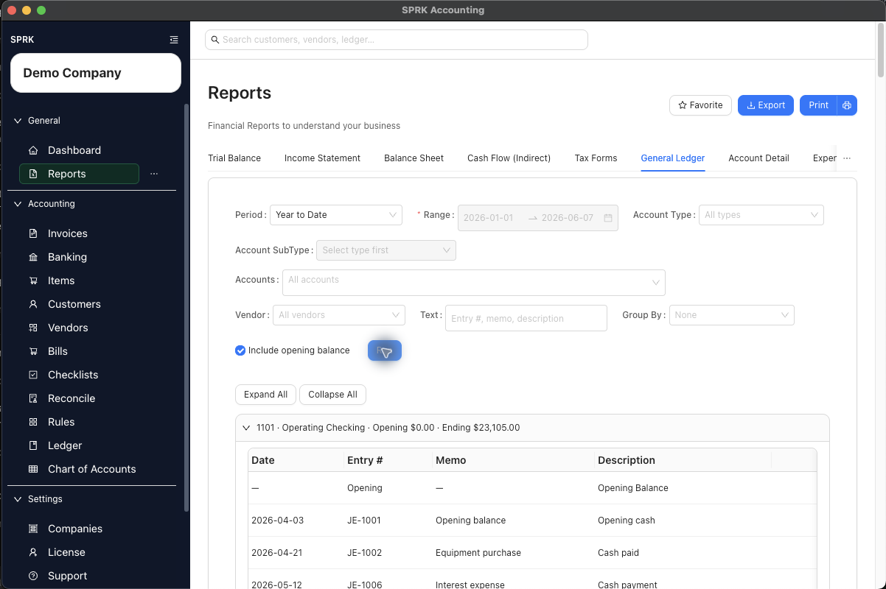
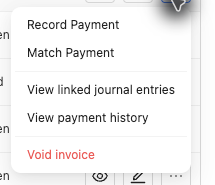

# Understand Invoice General Ledger Impact

Understand how invoice creation, `Receive to` routing, customer and item defaults, customer terms, Open status recognition, paid-now invoices, aging review, and payment receipt affect the general ledger and receivables review in SPRK.

## When To Use This

Use this article when you need to understand what SPRK currently posts to the general ledger during invoice creation and payment receipt, and what setup defaults do not change about that posting pattern.

## Before You Start

- You understand the difference between `Draft`, `Open`, `Partial`, and `Paid` invoice statuses.
- You have access to the invoice workflow and, if needed, the Ledger page for validation.

## Steps

1. Treat `Draft` and `Open` as different accounting states.
2. Use `Open` when you want SPRK to post the invoice through the selected `Receive to` route instead of keeping it unposted as a draft.
3. Review `Receive to` before the invoice posts.
4. Use an Accounts Receivable control account in `Receive to` when the invoice should remain open until payment is recorded.
5. Use a cash, bank, or credit-card settlement account in `Receive to` only when the invoice is being recorded as paid immediately.
6. Review `Default income account` and each line `Income account`; the line accounts are the posting source of truth.
7. Treat customer `Terms`, invoice `Due Date`, and item defaults as setup and timing data, not as the posting trigger.
8. Use `Receive payment` when cash or bank is collected after an open receivable already exists.
9. Verify the resulting status and balance in `Invoices`.
10. If you need to validate the posting, inspect the related activity in `Ledger`.
11. If you need collection follow-up, use receivables aging to review invoice terms, due dates, and overdue timing after the invoice is already posted.

## What Happens Next

Invoice posting behavior:

- Creating an invoice as `Draft` does not post a journal entry.
- Creating an invoice as `Open`, or updating an existing invoice from a non-open status to `Open`, posts according to the `Receive to` routing and the line income accounts.
- Recording a payment through `Receive payment` posts a separate payment journal entry and updates the invoice balance when the invoice is on the open receivables path.
- Recording a paid-now invoice with a settlement account in `Receive to` posts directly between the selected settlement account and the invoice income lines.

Open accrual invoice recognition when `Receive to` is an Accounts Receivable control account:

- Debit the selected Accounts Receivable control account for the invoice total.
- Credit each line's `Income account` for that line amount.

Paid-now invoice posting when `Receive to` is a non-control cash, bank, or credit-card settlement account:

- Debit the selected settlement account.
- Credit each line's `Income account`.
- The invoice does not remain open as an unpaid receivable.

Current payment entry when a payment is recorded:

- Debit the selected `Deposit to` account
- Credit the receivable account carried by the open invoice

Customer terms, customer credit settings, company invoice defaults, and item defaults affect setup and follow-up, but they do not replace routing and line-account review. Their main downstream effect is on invoice terms, due-date defaults, starting workflow status, data consistency, and receivables aging review.

Current aging behavior:

- If an invoice has invoice-level terms, aging can show those terms for that invoice.
- If an invoice does not carry its own terms, aging can fall back to the customer default terms.
- Aging review can show terms and overdue timing alongside the customer balance, which helps with collection follow-up.

Current status behavior when a payment is recorded:

- payment equals remaining balance: invoice becomes `Paid`
- payment is less than remaining balance: invoice becomes `Partial`
- payment greater than remaining balance: blocked

## If Something Looks Wrong

- Marking an invoice `Paid` by editing status instead of using `Receive payment`. The payment posting logic is tied to the payment workflow, not a manual status change.
- Assuming customer payment terms or credit settings choose the posting route. They do not.
- Assuming the header `Default income account` is the final posting source when line accounts have been filled. The line-level `Income account` controls the revenue side.
- Assuming customer, company, or item defaults automatically replace the need to review `Receive to` and line income accounts on each invoice.
- Choosing a settlement account in `Receive to` when you wanted an open receivable.
- Assuming tax is posted to a separate liability account. The current invoice recognition logic credits the full total to the income side.
- Assuming customer credit settings automatically stop or post invoice activity. Use them as setup and review signals, then follow the visible invoice workflow.
- Assuming invoice voiding deletes the original invoice or original journal. A successful `Void invoice` posts a reversal, moves the invoice to `Void`, zeroes the balance, and preserves audit details.
- Assuming active payments can remain in place while the invoice recognition posting is reversed. Reverse or unapply active payments first where SPRK requires that guardrail.

## Business Scenario: Invoice Void And Reversal Guardrail

Use this scenario to train reviewers on where the void action appears and why the action is different from deleting or manually editing the original journal entry.

- Sample file: [12-invoice-void-reversal.csv](../sample-files/v1-validation/12-invoice-void-reversal.csv)
- Evidence:

The walkthrough stopped at the enabled void action and did not confirm a destructive source-document reversal. The visible action proves the workflow entry point while preserving the demo company data.

## Related

- [Set up receivables defaults before invoicing](./set-up-receivables-defaults-before-invoicing.md)
- [Configure customer payment terms and credit](./configure-customer-payment-terms-and-credit.md)
- [Create and open invoices](./create-and-open-invoices.md)
- [Receive invoice payments](./receive-invoice-payments.md)
- [Review document payment history and linked journals](../ledger-and-chart-of-accounts/review-document-payment-history-and-linked-journals.md)
- [Manage items for invoicing](./manage-items-for-invoicing.md)
