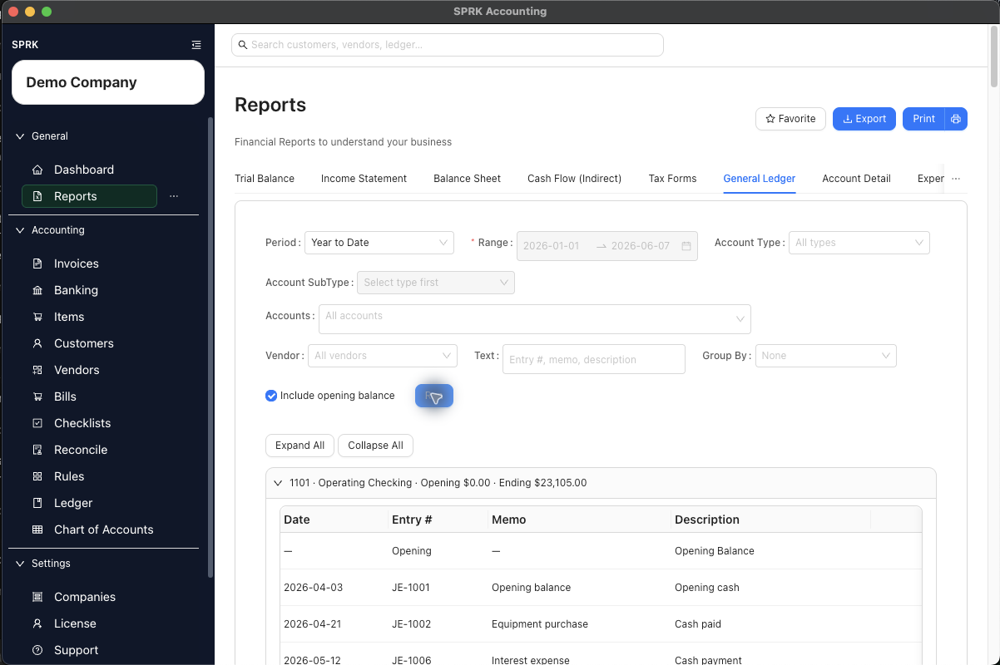
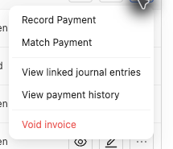

# Understand Invoice General Ledger Impact

Use this reference to see how invoice status, `Receive to` routing, line income accounts, payments, and voids affect receivables and the general ledger.

## Quick Reference

| Invoice State Or Action | Ledger Effect | Where It Matters |
|---|---|---|
| `Draft` invoice | No journal entry is posted | Invoice review before opening |
| `Open` invoice with Accounts Receivable in `Receive to` | Debits the receivable account for the total, credits line income accounts for the subtotal, and credits Sales Tax Payable when tax applies | Open AR, aging, tax liability, and payment follow-up |
| Paid-now invoice with a settlement account in `Receive to` | Debits the settlement account for the total, credits line income accounts for the subtotal, and credits Sales Tax Payable when tax applies | Sales recorded as paid immediately |
| `Receive payment` | Debits `Deposit to` and credits the receivable account carried by the open invoice | Customer payment and bank review |
| Payment equals remaining balance | Invoice becomes `Paid` | AR status and aging |
| Payment is less than remaining balance | Invoice becomes `Partial` | Collection follow-up |
| Payment is greater than remaining balance | Payment is blocked | Overpayment review |
| `Void invoice` | Posts a reversal, moves the invoice to `Void`, zeroes the balance, and preserves audit details | Source-document correction |
| Customer terms and due dates | No posting by themselves | Aging and collection review |
| Customer credit settings | Setup and review signal only | Customer review before invoicing |
| `Default income account` | Fills blank line income accounts where supported | Line review before posting |
| Line `Income account` | Controls the revenue side of the posting | Invoice creation and import |
| `Sales tax payable account` | Holds collected sales tax as a liability until it is remitted | Taxed Open and paid-now invoices |

## Details

Use `Open` when you want SPRK to post the invoice through the selected `Receive to` route instead of keeping it unposted as a draft. Use an Accounts Receivable control account in `Receive to` when the invoice should remain open until payment is recorded. Use a cash, bank, or credit-card settlement account only when the invoice is being recorded as paid immediately.

Customer terms, customer credit settings, company invoice defaults, and item defaults affect setup and follow-up, but they do not replace routing and line-account review. Their main downstream effect is on invoice terms, due-date defaults, starting workflow status, data consistency, and receivables aging review.

When sales tax applies, revenue is the invoice subtotal. The tax amount is credited separately to the invoice's `Sales tax payable account`. A taxed draft can remain incomplete, but SPRK requires an active liability account before the invoice can post. Older posted invoices created before this safeguard are not rewritten automatically; review any needed correction with your accountant and record it as a separate, supported adjustment.

Aging can show invoice-level terms for the invoice. If an invoice does not carry its own terms, aging can fall back to the customer default terms.

Do not confirm a void in a live company until active payments and reversal consequences have been reviewed.

## If Something Looks Wrong

| What You See | What To Check | What To Do Next |
|---|---|---|
| An invoice was marked `Paid` by editing status | Whether payment was recorded through `Receive payment` | Use the payment workflow so posting and balance update together |
| The invoice stayed open when it should have been paid-now | `Receive to` routing | Use a settlement account only when paid-now is intended |
| Revenue posted to the wrong account | Line-level `Income account` values | Correct line accounts before posting or use a supported correction path |
| Customer terms look correct but posting is wrong | `Receive to` and line accounts | Treat terms as timing data, not posting routing |
| Sales tax posted to an unexpected liability account | The invoice's `Sales tax payable account` | Review the saved invoice and use a posted correction path if its accounting entry must change |
| Void is needed but payments exist | Payment history and linked journal entries | Reverse the payment journal and confirm the payment-application reversal before voiding the invoice |

## Practice And Examples

- Practice file: [invoice-void-reversal.csv](../sample-files/practice/invoice-void-reversal.csv)

## Related

- [Create invoices](./create-invoices.md)
- [Receive invoice payments](./receive-invoice-payments.md)
- [Void or correct invoices](./void-or-correct-invoices.md)
- [Set up receivables defaults before invoicing](./set-up-receivables-defaults-before-invoicing.md)
- [Review document payment history and linked journals](../ledger-and-chart-of-accounts/review-document-payment-history-and-linked-journals.md)
