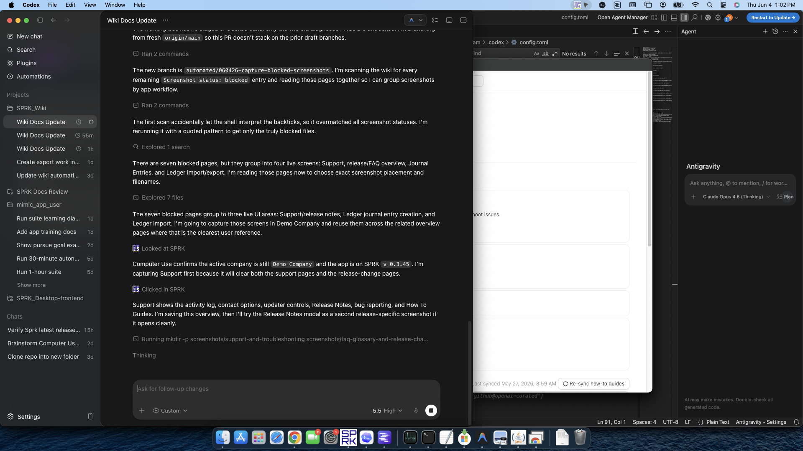

# Support And Troubleshooting

Use the Support tab to gather a session log, find contact options, review release notes when updater controls are available, and work through common product-navigation questions before escalating an issue.

## In This Section

- [Use the Support tab](./use-the-support-tab.md)
- [Collect the right details before contacting support](./collect-the-right-details-before-contacting-support.md)
- [Collect import run details for support](./collect-import-run-details-for-support.md)
- [Understand authenticated shared backend service mode](./understand-authenticated-shared-backend-service-mode.md)
- [Understand database alignment support boundaries](./understand-database-alignment-support-boundaries.md)
- [Troubleshoot common navigation or workflow confusion](./troubleshoot-common-navigation-or-workflow-confusion.md)

## Info

- App sections: `support`
- Last validated: 2026-06-17
- Screenshot status: `captured`
