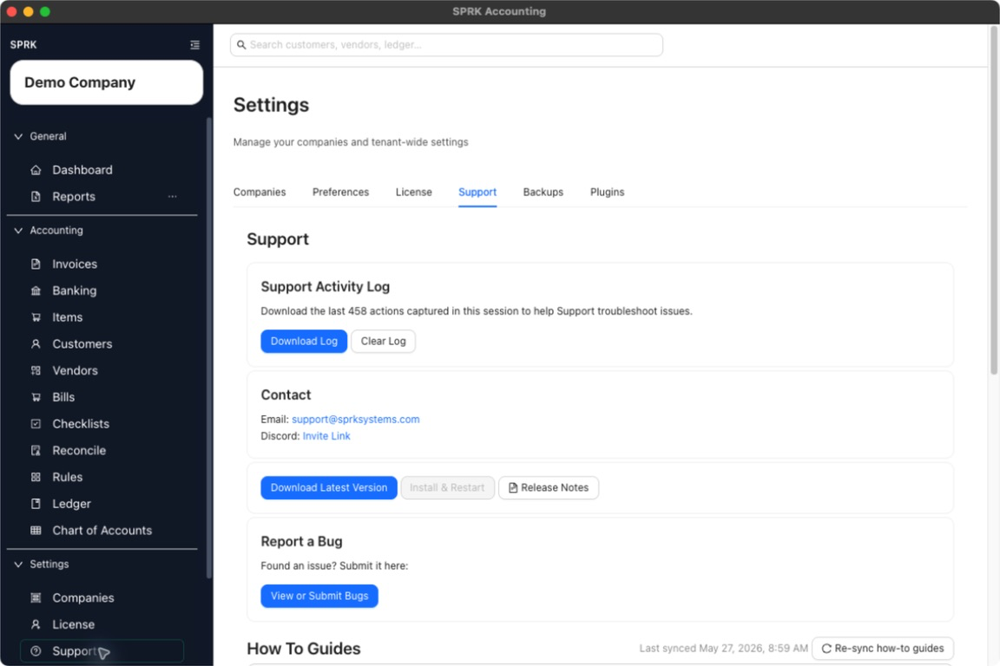
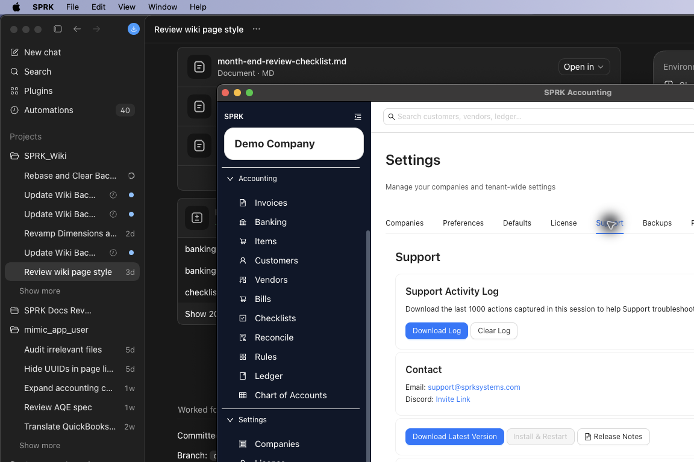

# Collect Import Run Details for Support

Gather the visible import context support needs after a failed, partial, duplicate, or confusing import.

## When To Use This

Use this workflow when an import preview, confirmation, or post-import review does not match what you expected.

## Steps

1. Stop before confirming another import attempt unless support asks you to retry.
2. Note the active company and import page.
3. Record the file type, such as `.csv`, `.xlsx`, `.qbo`, `.qfx`, `.ofx`, `.iif`, or `.zip`.
4. Record the destination account when the import is account-specific, such as a bank or credit-card account.
5. Capture visible preview details:
   - row or entry counts
   - duplicate warnings
   - unresolved accounts or vendors
   - validation messages
   - whether any rows were selected or skipped
6. Note whether you only previewed the file or confirmed it.
7. If you confirmed an import, write down what changed afterward: pending bank rows, journal entries, documents, accounts, vendors, or reports.
8. Open `Support` and download the `Support Activity Log`.
9. Include the company, page, file type, visible error text, preview details, confirmation status, and support log when contacting support.

## What Happens Next

Support receives enough context to distinguish preview-only issues from posted or partially reviewed results.

- Collecting details and downloading logs does not post accounting activity.
- Import preview diagnostics are not ledger postings by themselves.
- Confirmed imports can affect the ledger depending on the workflow, so be explicit about whether you confirmed.

## If Something Looks Wrong

- Reporting only that "the import failed" without the page, file type, or visible message.
- Retrying the same file multiple times before capturing duplicate warnings.
- Describing hidden technical fields that are not visible in SPRK.
- Assuming invoice, bill, bank, journal, and company imports all have identical rollback behavior.

## Business Scenario: Support Log And Guide Context

Use this scenario to train staff to capture visible import context, download the support activity log, and reference the synced guide set when an import behaves unexpectedly.

- Sample file: [25-import-run-details-support.csv](../sample-files/v1-validation/25-import-run-details-support.csv)
- Evidence:

The walkthrough confirmed the Support tab exposes a downloadable activity log and synced how-to guide sections that can accompany import screenshots and fixture files in a support handoff.

## Related

- [Collect the right details before contacting support](./collect-the-right-details-before-contacting-support.md)
- [Understand import and migration boundaries](../company-setup-and-migration/understand-import-and-migration-boundaries.md)
- [Import bank transactions](../banking-and-cash-management/import-bank-transactions.md)
- [Prepare and review ledger imports and exports](../ledger-and-chart-of-accounts/understand-ledger-import-and-export-behavior.md)
