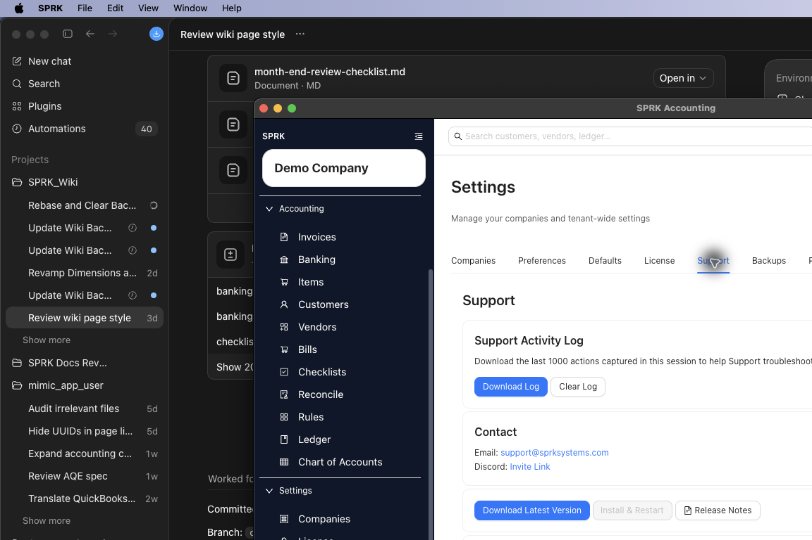

# Collect Import Run Details for Support

<!-- Screenshot status: Review needed -->

Gather visible import context after a failed, partial, duplicate, or confusing import without changing the source data again.

## When to use this

- An import preview does not match what you expected.
- An import confirmation creates unexpected records, pending rows, documents, or journal entries.
- Duplicate warnings, unresolved names, account issues, or validation messages need review.
- You need to contact support with the details of a specific import attempt.

## Do this first

1. Stop before confirming another import attempt unless support asks you to retry.
2. Note the active company and import page.
3. Record whether you only previewed the file or confirmed it.
4. If you confirmed an import, write down what changed afterward: pending bank rows, journal entries, documents, accounts, vendors, or reports.
5. Open `Support` and download the `Support Activity Log`.

## Details to capture

- Active company.
- Import page or workflow.
- File type, such as `.csv`, `.xlsx`, `.qbo`, `.qfx`, `.ofx`, `.iif`, or `.zip`.
- Destination account when the import is account-specific, such as a bank or credit-card account.
- Row or entry counts.
- Duplicate warnings.
- Unresolved accounts, customers, vendors, or items.
- Validation messages.
- Whether any rows were selected or skipped.
- Whether the import was preview-only or confirmed.
- What changed after confirmation.
- Support Activity Log.

## What to avoid

- Do not retry the same file repeatedly before capturing warnings.
- Do not make manual cleanup entries before saving the original mismatch details.
- Do not describe hidden technical fields that are not visible in SPRK.
- Do not assume invoice, bill, bank, journal, and company imports have identical correction behavior.

## If something looks wrong

| What You See | What To Check | What To Do Next |
|---|---|---|
| The import failed but the details are vague | Page, file type, visible message, and preview result | Capture the specific visible context before contacting support |
| Duplicate warnings disappeared after retrying | Whether the first preview details were saved | Stop and collect the current preview and support log |
| The result changed after confirmation | Which records, rows, documents, or journals changed | Record the changed area before attempting cleanup |
| The import type is unclear | Whether it was bank, journal, invoice, bill, company, or rule import | Use the workflow name support can trace |

## Practice and examples

- Practice file: [import-run-details-support.csv](../sample-files/practice/import-run-details-support.csv)

## Related

- [Collect the right details before contacting support](./collect-the-right-details-before-contacting-support.md)
- [Before you import](../company-setup-and-migration/before-you-import.md)
- [Import bank transactions](../banking-and-cash-management/import-bank-transactions.md)
- [Prepare and review ledger imports and exports](../ledger-and-chart-of-accounts/understand-ledger-import-and-export-behavior.md)
