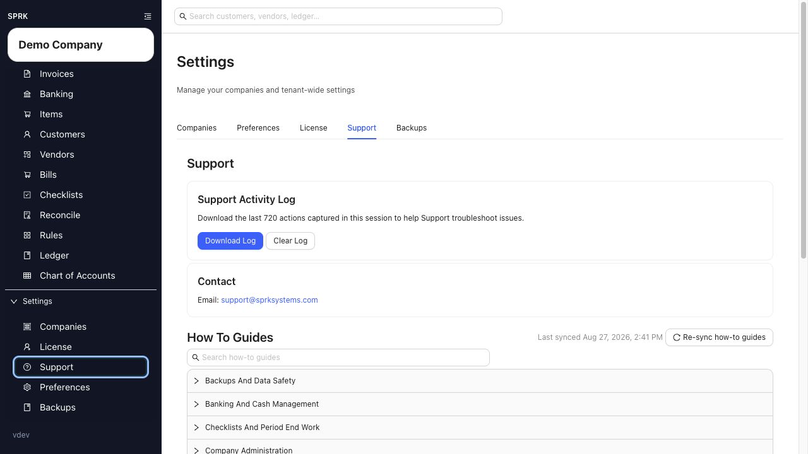

# Collect the Right Details Before Contacting Support

<!-- Screenshot status: Review needed -->

Prepare a clear support request by capturing the current session log, workflow, visible result, and affected records before reaching out.

## When to use this

- You need help with a visible SPRK result.
- You want to avoid a support back-and-forth for missing context.
- You need to preserve details before making manual cleanup changes.

## Do this first

1. Reproduce the issue once if it is safe to do so, so the current session log includes the relevant actions.
2. Note the active company, page, and workflow you were using when the problem happened.
3. Write down what you expected to happen and what happened instead.
4. Open `Support`.
5. In `Support Activity Log`, select `Download Log`.
6. Keep the downloaded text file ready to attach or quote when you contact support.
7. Email [support@sprksystems.com](mailto:support@sprksystems.com) and include the details below.

## Details to capture

- Company name.
- Page or workflow.
- What you expected to happen.
- What happened instead.
- Whether the issue blocks work completely or only slows it down.
- Record numbers, account, customer, vendor, document number, date range, statement period, or import file name as applicable.
- Any recent import, reversal, void, payment, or edit action.
- Visible error or warning text.
- Screenshot if it does not expose sensitive client data.
- Support Activity Log.

## What to avoid

- Do not clear the support log before downloading the session details you need.
- Do not make manual cleanup entries before capturing the original mismatch.
- Do not contact support with only "it failed" when the page, company, and workflow are available.
- Do not treat support activity as an accounting workflow; support actions are informational and operational only.

## If something looks wrong

| What You See | What To Check | What To Do Next |
|---|---|---|
| Support context is incomplete | Company, page, workflow, timing, and visible result | Add the missing details before contacting support |
| The log was downloaded before reproducing the issue | Whether the relevant session activity is included | Reproduce once if safe, then download the log again |
| Contact options look different than expected | Current channels shown in the `Support` tab | Use the options visible in SPRK |
| The issue involves import behavior | File type, preview details, confirmation status, and changed records | Use the import details support page |

## Related

- [Use the Support tab](./use-the-support-tab.md)
- [Troubleshoot common navigation or workflow confusion](./troubleshoot-common-navigation-or-workflow-confusion.md)
- [Collect import run details for support](./collect-import-run-details-for-support.md)
- [Switch between companies](../company-setup-and-migration/switch-between-companies.md)
