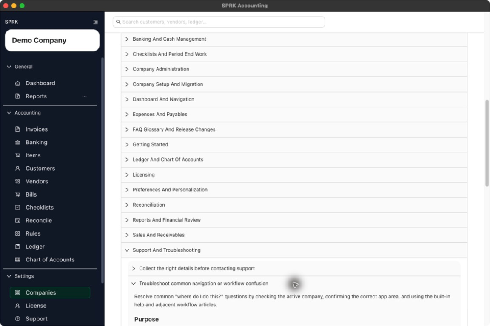

# Find a Missing Page or Task

<!-- Screenshot status: Review needed -->

Check the active company, the app area, and any required setup when a task or page seems to be missing.

## When to use this

Use this guide when a task feels missing, a page looks different than expected, or you are unsure which section of SPRK owns the workflow you need.

## Before you start

- You are signed in to SPRK.
- You can identify the workflow you are trying to complete.
- You can open the main navigation and the `Support` tab if you need help links.

## Steps

1. Confirm the active company first. Some views and records depend on which company is selected.
2. Check that you are in the correct product area for the task:
   - `Customers`, `Items`, and `Invoices` for sales activity.
   - `Vendors`, `Bills`, and `Checks` for payables activity.
   - `Banking` and `Rules` for imported bank activity and automation.
   - `Ledger` and `Chart of Accounts` for manual journal and account structure work.
   - `Reports` for financial review.
   - `Companies`, `Preferences`, `License`, `Support`, and `Backups` for settings-style tasks.
3. If a workflow depends on a record, confirm that the needed company, customer, vendor, item, or account already exists.
4. If you were expecting imported data, confirm that the import step finished in the right workflow and that you returned to the page where review happens next.
5. Open `Support` and expand `How To Guides` for a quick in-product refresher if you need it.
6. If you still cannot find the workflow, open the related public wiki article for the exact page you are trying to use.
7. If the page still seems unavailable or different than expected, collect a support log and contact support with the page name and company context.

## What happens next

You can usually narrow the problem to the active company, the wrong app section, a missing prerequisite record, or a need for support follow-up.

## If something looks wrong

| What You See | What To Check | What To Do Next |
|---|---|---|
| Imported activity still needs review | Whether the destination page shows a preview, pending row, or confirmation action | Complete that page's review before treating the import as final |
| A support request lacks context | Whether it names the company, page, and workflow | Add those details before emailing support |

## Related

- [Use the Support tab](./use-the-support-tab.md)
- [Collect the right details before contacting support](./collect-the-right-details-before-contacting-support.md)
- [Move between major app areas](../dashboard-and-navigation/move-between-major-app-areas.md)
